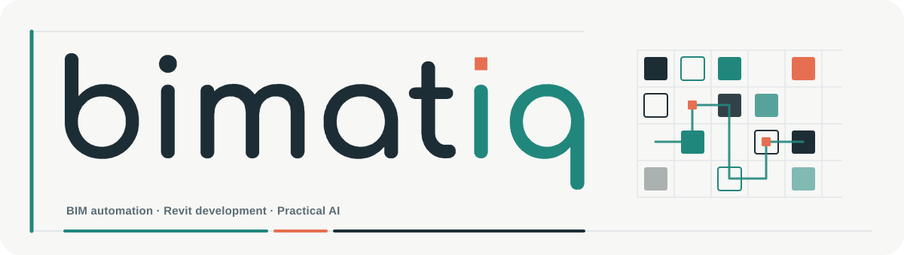
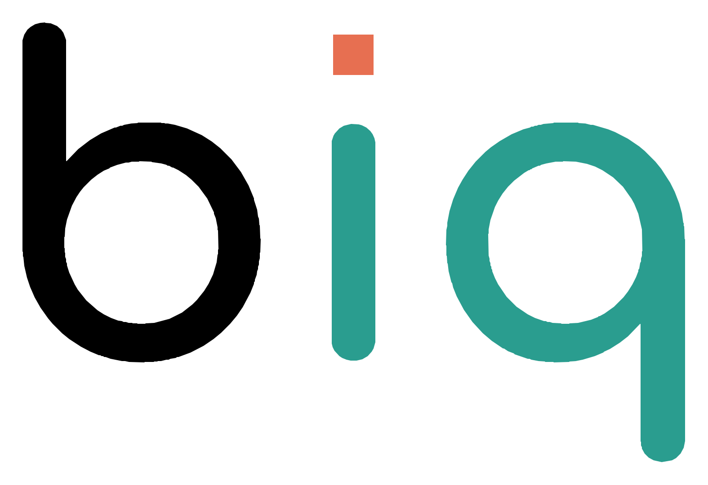

 

 

## About Bimatiq

Bimatiq is a BIM and design automation consultancy focused on improving how design and construction teams structure, produce, check and automate information.

We work where BIM standards, model data, software and AI need to operate together in a reliable and practical way.

Our approach starts with the workflow and the information. Technology comes after the problem is understood.

 

## What we do

### Revit automation

We develop focused Revit tools and workflows that reduce repetitive work, improve consistency and make structured project information easier to use.

Typical areas include model data, documentation, drawing production, schedules, quality checks and controlled model operations.

### BIM systems and standards

Reliable automation needs a reliable BIM environment.

We work with templates, families, parameters, naming standards, structured model data, documentation standards and controlled Revit environments.

### Design automation

We connect project information, rules and repeatable processes to reduce manual production work and improve consistency.

The objective is not simply to automate commands. It is to improve the complete information workflow.

### Practical AI implementation

AI can support interpretation, analysis, orchestration and workflow automation.

Bimatiq focuses on controlled implementation where AI supports professional work while clear validation remains part of the process.

### DfMA and modular workflows

Our experience includes modular construction, manufacturing information, structured drawing production and design for manufacture and assembly workflows.

This helps automation respond to real production requirements rather than only generic BIM processes.

 

## Core technology

**Revit**  
Primary BIM environment for modelling, information management, documentation and automation.

**C Sharp**  
Used for native Revit development, structured automation tools and deeper integration with the Revit API.

**Python**  
Used for data processing, automation, validation and lightweight workflow development.

**Dynamo**  
Used for visual automation, rapid workflow development and repeatable Revit processes.

**AI**  
Used for controlled interpretation, reasoning, workflow orchestration and automation support.

**Git**  
Used for controlled source history, development tracking, review and software delivery.

 

## Our automation method

### Understand → Structure → Automate → Validate → Improve

**01 Understand the workflow**  
Identify where information comes from, how it is used and where manual work creates friction.

**02 Structure the information**  
Create reliable standards, data structures and rules before introducing automation.

**03 Automate the right process**  
Choose the simplest technology that can solve the problem reliably.

**04 Validate the result**  
Automation should produce something that can be checked, understood and trusted.

**05 Improve continuously**  
Real use provides the evidence needed to refine workflows and expand automation safely.

 

## Development principles

**Workflow first**  
Technology should respond to a real production problem.

**Structure before automation**  
Reliable automation depends on reliable information.

**Controlled behaviour**  
Tools should have clear inputs, outputs, limits and failure behaviour.

**Human review where it matters**  
Professional judgement remains part of workflows where the result requires validation.

**Clear ownership and boundaries**  
Company systems, partner information and reusable technology should remain properly separated.

**Evidence before claims**  
A prototype proves a concept. Testing and validation are required before a system is treated as ready for production use.

 

## Current direction

Bimatiq is developing reusable systems for controlled Revit automation and connected design workflows.

Our direction brings together Revit development, BIM standards, structured information, design automation, AI orchestration, digital delivery workflows and DfMA knowledge.

The goal is to create practical systems that help design and construction teams work with information more reliably and efficiently.

 

## Founder

### Bryan Morales

**Founder of Bimatiq · Design Automation Specialist**

Background in architecture, BIM management, Revit automation and DfMA workflows.

Focused on connecting design knowledge with software and automation to solve practical production problems.

 

 

**BIM Automation · Revit Development · Digital Workflows · Practical AI**

*Building better ways to work with design information.*

